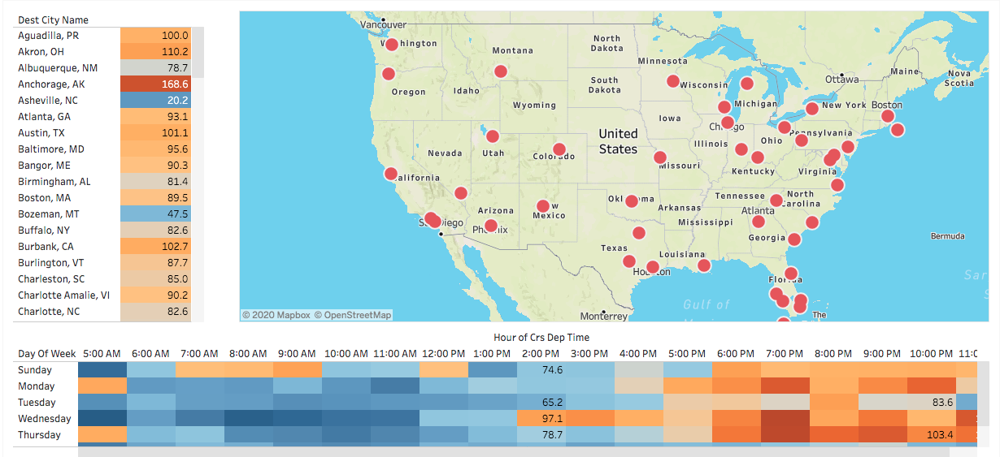
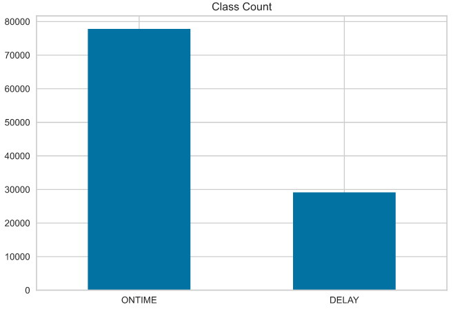
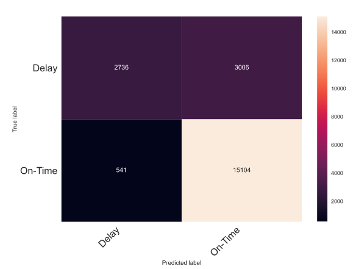
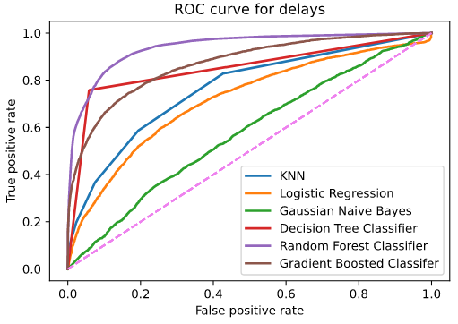
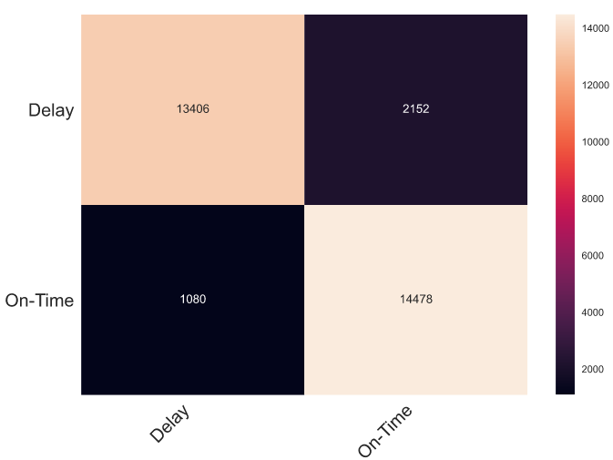
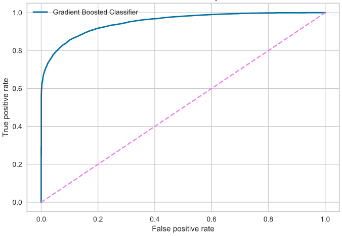

## Project 3: Classification: Flight Departure Delays from the New York City Metro Area

### Predicting Departure Delays during the summer travel months from La Guardia, John F. Kenney, and Newark International Airports

#### Presentation Link: [YouTube](https://www.youtube.com/watch?v=MNy65IYIx24&t=13s)
#### Tableau Dashboard: [Tableau](https://public.tableau.com/profile/ridwan8717#!/vizhome/DepartureDelays_16038881216180/Dashboard1?publish=yes)

#### Back story:

Using data from the Bureau of Transportation Statistics (BTS) for the summer months of 2019 (June, July, and August) from La Guardia, John F. Kennedy, and Newark International Airports, a model will be created using supervised learning techniques to better understand flight departure delays from New York City area airports. 

#### Flight delay: The Federal Aviation Administration (FAA) considers a flight to be delayed when it is 15 minutes later than its scheduled time. 

Different Types of Delays:
- Air Carrier: The cause of the cancellation or delay was due to circumstances within the airline's control (e.g. maintenance or crew problems, aircraft cleaning, baggage loading, fueling, etc.).
- Extreme Weather: Significant meteorological conditions (actual or forecasted) that, in the judgment of the carrier, delays or prevents the operation of a flight such as tornado, blizzard or hurricane.
- National Aviation System (NAS): Delays and cancellations attributable to the national aviation system that refer to a broad set of conditions, such as non-extreme weather conditions, airport operations, heavy traffic volume, and air traffic control.
- Late-arriving aircraft: A previous flight with same aircraft arrived late, causing the present flight to depart late.
- Security: Delays or cancellations caused by evacuation of a terminal or concourse, re-boarding of aircraft because of security breach, inoperative screening equipment and/or long lines in excess of 29 minutes at screening areas.

### Learning Goals of Project 3
1. Data into a postgres database
2. Create a classification model
3. Interactive Visualization

#### Required Skills & Tools

* supervised learning
  * Balancing (Random Over Sampler, SMOTE, ADASYN, Random Under Sampler)
  * Modeling (KNearest Neighbors, Logistic Regression, Gaussian Naive Bayes, Decision Trees, Random Forest Classifier, Gradient Boosted Classifier)
  * Accuracy, Precision, Recall, and F1 scores
  * Cross-Validation
  * Hyperparameter Tuning
  * ROC-AUC Curve
* SQL
* Tableau

 #### Data Collection and Clean-Up

Using the Bureau of Transportation (BTS) as the primary data source, all flight information was collected from here. Specific data collected were Origin, Destination, Carrier, Departure Time, Departure Delay, Arrival Time, Arrival Delay, Distance from airports, Time of Flight, and among others to ensure a holistic approach to the data analysis.

The separate datasets collected below were concatenated and then filtered by only La Guardia (LGA), John F. Kennedy (JFK), and Newark (EWR) International Airports.

Then a DELAY column was created for the purposes of a binary classification. If the departure delay was greater than 15 minutes then it would be considered delayed based on FAA guidelines, otherwise, on-time.

#### Feature Selection

The initial features were day of the week, carrier, origin, destination, departure time, and distance. I wanted to supply the model with only information it would know before someone boarded plane. So things such as arrival time and elapsed air time were removed because these would be unknowns before boarding a plane.

The set was broken into a X-set (features) and y-set (target). They were both pickled for ease of retrieval later. 

#### Train/Test Split

Train, test, split were applied to begin classification with the different models. K-Nearest Neighbor, Logistic Regression, Decision Tree, Random Forest, Gradient Boost, and Gaussian. 

Process: 

1. Split the dataset into three pieces: a **training set**, **validation set**, and **test/hold-out set**
2. Train the model on the **training set**.
3. Test the model on the **validation set**, and evaluate how well it did.
4. Locate the best model using cross-validation on the remaining data, and test it **using the test/hold-out set**
5. More reliable estimate of out-of-sample performance since hold-out set is **truly out-of-sample**

For KNN and Logistic Regression the features would need to be scaled.

#### Class Imbalance and Balancing Data

After all the data was cleaned. The class imabalance between Delays and On-Time departures were compared. We do not want the model to train on only one of the classes as that would lead to inaccurate scores.

#### All Models Ran + RandomOversampling and SMOTE
All models were observed (KNeighborsClassifier, LogisticRegression, Gaussian Naive Bayes, Decision Tree Classifier, Random Forest Classifier, Gradient Boosted Classifer) and their scores. Then I focused on the accuracy, precision, recall, and the F1 score then applied the Randomoversampling and SMOTE to balance. 

#### Cross-Validation

Cross-validation was completed to have a more **reliable** estimate of out-of-sample performance than train/test split

#### Gradient Boosted Classifier Hyperparameter Tuning

The Hyperparameters below were tuned for optimal scores: 

**n_estimators**: number of base learner trees  
**max_depth**: max depth per base tree (typical values are 3-12)   
**learning_rate**: shrinkage factor applied to each base tree update  
**subsample**: row subsampling rate (similar to RF)   
**min_child_weight**: roughly the minimum allowable child samples for a tree split to occur  
**colsample_bytree**: feature subsampling rate (similar to RF) 

The use of a learning rate/shrinkage factor is a form of regularization that can greatly reduce overfitting. It typically trades off with the n_estimators and depth parameters (raising these add complexity) -- lower learning rate  usually wants higher n_estimators, higher max depth usually wants lower learning rate etc. The two subsampling parameters and min_child_weight are also forms of regularization. These types of tradeoffs are part of why it typically works better to follow a manual tuning procedure than to try a massive grid search across different parameter combinations. That simply doesn't scale well to large datasets. 

#### ROC-AUC Curve
The intepretation of the _Area Under the Curve_ (AUC) is the probability that a randomly chosen positive example (in this case, fraud) has a higher score than the randomly chosen negative example (in this case, legitimate transactions).

All the models plus RandomOversampler and SMOTE were plotted to be as thorough as possible during our process. 

#### Final Model & Results
For the final model, I have chosen Gradient Boosted Classifier with SMOTE to handle class imabalance. As aforementioned, it was the most realistically balanaced with high precision, recall, accuracy, f1, and ROC-AUC scores. I ran Feature Importance, Confusion Matrix, Classification Report, and finally the ROC-AUC curve on the test data to finish the model. 

Overall, I shyed away from Random Forest Classifier because of the near perfect balance. It just would not be something I would be able to justify currently and would require further exploration. Gradient Boosted Classifier with SMOTE plus hyperparameter tuning gave high scores in the high 80s to lower 90s for Accuracy, Precision, Recall, F1, and ROC-AUC. I have the most confidence in this model going forward. 

